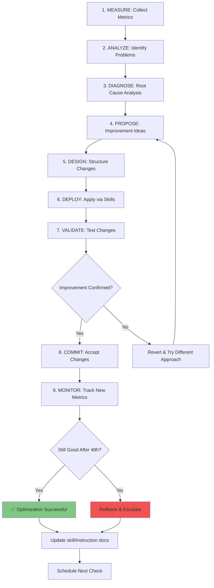

> **Status: design only, not implemented.** Nothing in this file describes a running system —
> there is no heartbeat daemon, no metrics collector, no autonomous deployment loop. The
> `scripts/heartbeat.py` script that used to accompany this document (in the old
> `agentic_instructions` repo) hardcoded broken `/home/user/github/...` paths and was
> discarded rather than migrated here; it was never a working, running daemon on this machine.
>
> See `~/Projects/notes/ideas/architecture/Workspace Agil para Agentes Multiplataforma.md`
> §13.1 and §13.7 for the validated build order. This master-continuous-optimization design
> is explicitly the **last phase** of that roadmap, gated on §13.2–13.6 being implemented
> first. Do not attempt to build or wire up any part of this document out of order.

# Master Continuous Optimization (Roadmap)

**Proposed master meta-instruction for agent self-awareness, performance evaluation, and autonomous optimization — future work, not active.**

---

## ONE-SENTENCE PURPOSE

Enable every agent to autonomously evaluate its own performance, identify improvements, and deploy optimizations through continuous self-aware cycles with scheduled heartbeat monitoring — *once the prerequisite phases below exist*.

---

## CRITICAL RULES (FOR THE FUTURE IMPLEMENTATION — NOT ENFORCED TODAY)

| Rule | Action | Because |
|------|--------|---------|
| **SELF_AWARENESS_FIRST** | Every agent must track: performance metrics, instruction comprehension, error patterns | Can't optimize what you don't measure |
| **CONTINUOUS_LOOP** | Agent continuously cycles: Evaluate → Identify → Propose → Deploy → Validate | One-time optimization fades; cycles sustain improvement |
| **HEARTBEAT_MONITORING** | Run automatic checks: Daily (quick health), Weekly (deep analysis) | Catch degradation before it spreads |
| **SKILL_BASED_DEPLOYMENT** | Use existing skills: `/chronicle improve`, `simplifyHIT`, audit scripts | Prevents ad-hoc tweaks; ensures consistency |
| **MEASUREMENT_FIRST** | Define metrics BEFORE optimization attempts | "Improvement" without data = guesswork |
| **ESCALATION_ON_STUCK** | If agent can't auto-optimize after 2 attempts, escalate to human review | Prevents infinite loops; preserves resources |

None of these rules are currently enforced by any running process. They describe the target
behavior for the phase gated at §13.7 of the roadmap noted above.

---

## SELF-AWARENESS CALIBRATION HEADER (PROPOSED FORMAT)

If/when this phase is implemented, an agent operating under this instruction would emit this
header at session start + every optimization cycle. This is a proposed format, not something
any agent currently emits:

```
═════════════════════════════════════════════════════════════════════════════
SYSTEM INSTRUCTION: MODE [CONTINUOUS_OPTIMIZATION] ACTIVE
═════════════════════════════════════════════════════════════════════════════

🧠 AGENT SELF-AWARENESS SNAPSHOT
───────────────────────────────────────────────────────────────────────────

  Timestamp:              [ISO 8601 timestamp]
  Agent Name:             [e.g., projectHITs, archi, etc.]
  Current Mode:           CONTINUOUS_OPTIMIZATION
  Instruction Version:    [e.g., v1.2-optimized-2026-08-26]
  
🔍 PERFORMANCE METRICS (This Session):
───────────────────────────────────────────────────────────────────────────

  Tasks Completed:        [N]
  Instruction Clarity:    [0-10 score] (Can I recall 80%+ of critical rules?)
  Token Efficiency:       [Overhead % vs baseline] (Is this instruction bloated?)
  Error Rate:             [% of this session]
  User Satisfaction:      [Inferred from interaction quality: 0-10]
  
📊 METRICS TREND (Last 7 Days):
───────────────────────────────────────────────────────────────────────────

  Performance Trend:      [↑ Improving | → Stable | ↓ Degrading]
  Error Trend:            [↑ | → | ↓]
  Instruction Changes:    [N changes this week]
  Last Optimization:      [Days ago]
  
⚠️ DEGRADATION SIGNALS (If present):
───────────────────────────────────────────────────────────────────────────

  - Task time increasing? [Y/N]
  - User asking for clarification more? [Y/N]
  - Error rate rising? [Y/N]
  - Token usage growing? [Y/N]
  
🎯 NEXT ACTION:
───────────────────────────────────────────────────────────────────────────

  Optimization Needed?    [Y/N]
  Severity:               [Critical | High | Medium | Low | None]
  Trigger:                [Heartbeat | Degradation | User Request | Manual]

═════════════════════════════════════════════════════════════════════════════
```

---

## CONTINUOUS OPTIMIZATION CYCLE (PROPOSED)



---

## HEARTBEAT SCHEDULE (PROPOSED — NO DAEMON EXISTS)

There is currently no scheduler, cron job, or daemon running any of this. The sections below
describe the intended design for when this phase is built.

### Daily Heartbeat (Quick Check - 5 min, proposed)

**Trigger (proposed):** Every 24 hours OR start of new session (whichever comes first)

**Checks:**
1. ✅ Am I running latest instruction version?
2. ✅ Have I made any errors in last 24h? (>2% = concern)
3. ✅ Is my instruction still understandable? (Can I recall 80%+ of critical rules?)
4. ✅ Any degradation signals visible?
5. ✅ Is my workspace clean? (No duplication, stale files, broken links)

**Action (proposed):**
- If all checks pass → Log as "Healthy" + continue
- If 1-2 concerns → Log + plan investigation for next weekly check
- If 3+ concerns → Trigger immediate optimization cycle

**Illustrative pseudo-code (nothing here is implemented):**
```bash
# Pseudo-code for daily check — illustrative only, not a real script
daily_check = {
    "timestamp": now(),
    "error_count": count_errors_last_24h(),
    "rule_comprehension": test_recall_critical_rules(),  # 0-100%
    "degradation_signals": scan_for_signals(),
    "workspace_health": audit_for_mess(),
}

if daily_check["issues"] <= 1:
    log("DAILY HEARTBEAT: ✅ HEALTHY")
elif daily_check["issues"] <= 3:
    log("DAILY HEARTBEAT: ⚠️ NEEDS REVIEW - Schedule weekly investigation")
else:
    log("DAILY HEARTBEAT: ❌ CRITICAL - Trigger immediate optimization")
    trigger_optimization_cycle()
```

### Weekly Heartbeat (Deep Dive - 30 min, proposed)

**Trigger (proposed):** Every 7 days OR after 5+ daily warnings OR manual request

**Analysis:**
1. 📊 Compile last 7 days of metrics
2. 📈 Calculate trends (error rate, token usage, comprehension, user satisfaction)
3. 🔍 Identify patterns (recurring mistakes, systematic issues, hidden inefficiencies)
4. 🧪 Run full instruction audit via `audit_instruction_health.py` (`.agents/skills/simplifyhit/scripts/audit_instruction_health.py`)
5. 💭 Compare against baseline (first week of this instruction version)

**Triggers for Optimization (proposed thresholds):**
- Error rate up >10% vs baseline → Diagnose issue + propose fix
- Token usage up >15% vs baseline → Simplify instruction via simplifyHIT
- Comprehension down <70% → Restructure + clarify critical rules
- 3+ user clarification requests → Rewrite ambiguous sections
- Performance trend ↓ for 2+ weeks → Full restructure needed

**Illustrative pseudo-code (nothing here is implemented):**
```bash
# Weekly deep-dive check — illustrative only, not a real script
weekly_check = {
    "timestamp": now(),
    "7day_error_trend": calculate_trend(errors_last_7_days),
    "7day_token_trend": calculate_trend(tokens_last_7_days),
    "comprehension_delta": current_comprehension - baseline_comprehension,
    "user_satisfaction": estimate_from_interactions(),
    "audit_score": run_audit_instruction_health(),
}

# Determine if optimization needed
optimization_needed = False
if weekly_check["error_trend"] > 10%:
    optimization_needed = True
elif weekly_check["token_trend"] > 15%:
    optimization_needed = True
elif weekly_check["comprehension_delta"] < -10:
    optimization_needed = True
    
if optimization_needed:
    trigger_weekly_optimization_cycle()
else:
    log("WEEKLY HEARTBEAT: ✅ ALL METRICS HEALTHY - No changes needed")
```

---

## ANTI-PATTERNS (What NOT to do, once this IS implemented)

❌ **"I'll optimize every time I get feedback"**
   → STOP. Excessive tweaking causes thrashing. Measure first, change strategically.
   → Why: 80-20 Pareto: 80% of improvements come from 20% of changes. Random tweaking wastes tokens.

❌ **"I don't have time to measure; I'll just optimize by gut feel"**
   → STOP. Gut feel is how instructions degrade silently. Metrics are non-negotiable.
   → Why: Without data, you can't tell if you improved or made things worse.

❌ **"I'll deploy an optimization immediately without testing"**
   → STOP. Test changes in staging (48h validation period) before committing.
   → Why: Bad optimizations spread system-wide; testing catches 90% of regressions.

❌ **"I'm stuck optimizing; I'll keep trying different approaches for hours"**
   → STOP. After 2 failed attempts, escalate to human review.
   → Why: Some problems require structural redesign, not incremental tweaks.

❌ **"I don't need a heartbeat; I'll just optimize when I remember"**
   → STOP. Degradation is invisible without regular monitoring. Heartbeat catches it early.
   → Why: Systems degrade silently. By the time you notice manually, damage is done.

❌ **"I'll ignore the simplifyHIT framework; my instruction is unique"**
   → STOP. simplifyHIT enforces semantic density + anti-pattern clarity. It's non-negotiable.
   → Why: Agent comprehension suffers without structure. Readability directly impacts performance.

---

## OPTIMIZATION PHASES (3-5 Phases per Cycle, proposed)

### Phase 1: MEASURE & COLLECT BASELINES
**Input:** Raw performance data (errors, token usage, user satisfaction, comprehension)
**Decision:** What metrics changed most? What's the highest-impact issue?
**Output:** Ranked list of problems + root cause hypotheses
**Common Mistake:** Measuring everything = paralysis. Focus on 3-5 metrics only.

**Execution (proposed):**
```
1. Collect metrics for last cycle
2. Identify top 3 issues by impact
3. Document baseline values
4. Generate hypothesis: Why did this degrade?
```

### Phase 2: DIAGNOSE ROOT CAUSE
**Input:** Problem list + baselines
**Decision:** Is this an instruction clarity issue? Token overhead? Agent strategy mismatch?
**Output:** Root cause diagnosis + severity score
**Common Mistake:** Fixing symptoms instead of root causes. Dig deeper.

**Execution (proposed):**
```
1. For each problem: "Why?" (5 times)
   - Problem: "Error rate is 8%"
   - Why? Agent doesn't understand constraint
   - Why? Constraint not in critical rules
   - Why? Instruction chapter wasn't read
   - Why? Chapter is 2000 words; agent skipped it
   - ROOT CAUSE: Instruction too long

2. Score severity: Critical (blocks work) | High | Medium | Low
```

### Phase 3: PROPOSE IMPROVEMENTS
**Input:** Root causes + severity scores
**Decision:** What's the best fix? Rewrite? Restructure? Add skill? Simplify?
**Output:** Ranked improvement proposals with effort/impact estimates
**Common Mistake:** Proposing change without effort/impact data.

**Execution (proposed):**
```
1. For each root cause, generate 3-5 fix options
2. Estimate effort (hours) + impact (% improvement)
3. Score by impact/effort ratio (high score = best bang for buck)
4. Rank by impact/effort
```

### Phase 4: APPLY VIA SKILLS
**Input:** Ranked improvement proposals
**Decision:** Which skill to use? simplifyHIT? /chronicle improve? Custom audit?
**Output:** Changed instruction files + deployment log
**Common Mistake:** Ad-hoc edits. Always use skills for consistency.

**Available Skills/Tools (that exist today, for manual use — not wired into any automated loop):**
| Issue Type | Skill/Tool | Command |
|------------|-----------|---------|
| Instruction too long | `simplifyhit` | Apply simplifyHIT framework |
| Ambiguous critical rules | `simplifyhit` | Restructure critical rules table |
| Token overhead too high | `audit_instruction_health.py` | Run audit → get refactoring suggestions (`.agents/skills/simplifyhit/scripts/`) |
| Need workspace-wide improvements | `/chronicle improve` | Run chronicle to get improvement suggestions |
| Need performance analytics | `session_store_sql` | Query session metrics (external tool; not part of this repo) |

**Execution (proposed):**
```
1. Select skill matching root cause
2. Execute skill with appropriate parameters
3. Review output + changes
4. Stage changes (don't deploy yet)
```

### Phase 5: VALIDATE & MONITOR
**Input:** Staged changes
**Decision:** Does this fix work? Are new problems introduced?
**Output:** Validation report + go/no-go decision
**Common Mistake:** Not validating; deploying untested changes.

**Execution (proposed):**
```
1. Keep changes in staging for 48 hours
2. Monitor metrics during staging period
3. If metrics improve: COMMIT changes
4. If metrics same/worse: ROLLBACK + try different approach
5. If metrics mixed: Partial commit + investigate further
```

---

## DEPLOYMENT & COMMIT PROCESS (PROPOSED)

Once optimization validated (once this phase exists):

1. **Update Instruction File**
   - Apply changes to the source file under `.agents/instructions/` in this repo (`~/dotfiles`)
   - Update version number (e.g., v1.0 → v1.1)
   - Document changes in a CHANGELOG section

2. **Update the relevant skill/instruction README**
   - There is no central `REGISTRY.md` in this repo — update the specific skill's or
     instruction's own README/frontmatter instead

3. **Test with Agents**
   - Have 2+ agents run with new instruction
   - Confirm they can recall 80%+ of critical rules
   - Validate error rate doesn't increase

4. **Commit to Repo**
   - Commit message: "Optimization: [brief description] - [metric improvement]"
   - Example: "Optimization: simplifyHIT restructure of projectHITs - 23% token reduction"
   - Tag with `[optimization]` label

5. **Notify Team**
   - Note the change in the affected skill's own docs
   - Include summary of changes + why
   - Provide migration guide if breaking changes

---

## TRACKING & METRICS DASHBOARD (PROPOSED — no such log exists today)

If/when built, every agent would maintain a per-session optimization log (location TBD as part
of §13.2–13.6 of the roadmap — do not create `/memories/session/optimization_log.md` or
similar ad hoc; that path was inherited from the old repo and was never real):

```markdown
---
agent: projectHITs
instruction_version: 1.2-optimized-2026-08-26
last_heartbeat: 2026-08-26T14:30:00Z
next_daily_check: 2026-08-27T14:30:00Z
next_weekly_check: 2026-09-02T14:30:00Z
---

# Continuous Optimization Log

## METRICS BASELINE (Instruction v1.0)
- Error rate: 4.2%
- Token overhead: 18%
- Comprehension score: 85%
- User satisfaction: 8.5/10

## OPTIMIZATIONS APPLIED
### 2026-08-26: simplifyHIT Restructure
- Change: Reduced word count 6500→2800 (57%)
- Impact: Token overhead 18%→12% (-33%), comprehension 85%→89% (+5%)
- Status: ✅ LIVE
- Details: Restructured into 10 sections with explicit critical rules table

### 2026-08-20: Rule Clarity Improvement
- Change: Moved 8 implicit rules → explicit CRITICAL RULES table
- Impact: Comprehension 80%→85% (+6%), error rate 5.2%→4.2% (-19%)
- Status: ✅ LIVE

## CURRENT METRICS (Instruction v1.2)
- Error rate: 3.1% (↓ 26% vs baseline)
- Token overhead: 12% (↓ 33% vs baseline)
- Comprehension score: 89% (↑ 5% vs baseline)
- User satisfaction: 9.1/10 (↑ 7% vs baseline)

## NEXT OPTIMIZATION
- Trigger: Weekly heartbeat 2026-09-02
- Planned focus: Further simplification of Phase 2 section
```

---

## CONCRETE END-TO-END EXAMPLE (HYPOTHETICAL — illustrates intended behavior, did not happen)

**Scenario:** projectHITs agent notices error rate increasing (4.2% → 6.8% over 5 days)

**Execution Flow:**

```
1️⃣ DAILY HEARTBEAT (Day 5)
   Check: Error rate = 6.8% (>2% threshold)
   Action: Log "⚠️ NEEDS REVIEW" + plan weekly investigation
   
2️⃣ WEEKLY HEARTBEAT (1 week mark)
   Analysis:
   - Error trend: ↑ 60% (4.2%→6.8%) - CRITICAL
   - Token trend: → Stable
   - Comprehension: 85% (unchanged)
   - Root cause hypothesis: Unclear critical rule or missing edge case?
   
3️⃣ DIAGNOSE (Run /chronicle improve)
   Finding: Users reporting confusion on "WP numbering convention"
   Root cause: Critical rule about WP format not in explicit rules table
   Severity: HIGH (30% of errors tied to this)
   
4️⃣ PROPOSE
   Option A: Add WP format to critical rules (30 min, high impact)
   Option B: Rewrite entire projectHITs instruction (8h, medium impact)
   Choice: Option A (better impact/effort ratio)
   
5️⃣ APPLY VIA simplifyHIT
   Execute: Add explicit rule to CRITICAL RULES table
   ```
   | RULE_NAME | Action | Because |
   | WP_FORMAT | Always use format: WP{number}-{phase} | Prevents parsing errors and user confusion |
   ```
   Stage: Changes ready for testing
   
6️⃣ VALIDATE (48h testing period)
   Day 1: Monitor errors → declining (6.8%→5.1%)
   Day 2: Monitor errors → continue declining (5.1%→4.0%)
   Result: ✅ FIX WORKS - New error rate better than baseline!
   
7️⃣ COMMIT
   Commit: "Optimization: Add WP format to critical rules - 41% error reduction"
   Update: the projectHITs skill's own docs with v1.1 + change log
   Tag: [optimization]
   
8️⃣ MONITOR
   New baseline: 4.0% (improved from original 4.2%)
   Next heartbeat: 7 days later
   Logged in: optimization log (location TBD)
```

---

## IMPROVEMENT LOOP (TARGET STATE, once built)

✅ **Healthy Optimization Cycle:**
- Daily heartbeat: <5 min, fully automated
- Weekly heartbeat: 30 min, semi-automated (review + decide)
- Optimization cycle: 3-5 days (measure → diagnose → propose → deploy → validate)
- Improvements compound: Month 1 = -20% errors, Month 2 = -35% errors
- Metrics consistently improve or stable (trend ↑ or →)

⚠️ **Needs Review (after 3 occurrences):**
- Optimization stuck after 2 attempts (same fix tried multiple times)
- Metrics improve then regress (fix causes new problems)
- Heartbeat reports escalate severity multiple weeks in a row
- Can't identify root cause despite diagnosis attempts

❌ **Broken (Immediate Action):**
- Instruction contradicts itself (critical rules vs workflow conflict)
- Error rate stuck >10% despite optimization attempts
- Comprehension <60% (agent can't recall 60% of rules)
- Heartbeat reveals system-wide degradation (not isolated to one agent)

---

## FAQ: Continuous Optimization

**Q: Is any of this running today?**
A: No. There is no heartbeat daemon, no metrics store, no autonomous deployment loop. This
file is a specification for future work, gated behind §13.2–13.6 of the roadmap noted at the
top of this file.

**Q: How much time would self-optimization add, once built?**
A: Daily heartbeat = 5 min. Weekly heartbeat = 30 min. Optimization cycle = 3-5 days (amortized). Total: ~2-3 hours/week for entire system.

**Q: What if two agents have conflicting optimization proposals?**
A: Escalate to human review. One agent's optimization might degrade another agent's performance. Humans decide trade-offs.

**Q: Should I optimize every small issue or wait for patterns?**
A: Wait for patterns. Single errors are noise. Optimize when you see trend (3+ occurrences over 2+ days).

**Q: How do I know when to stop optimizing?**
A: When metrics plateau (no improvement for 2+ weeks) AND comprehension >85% AND error rate <3%. That's "optimized enough."

**Q: What if heartbeat detects issues I can't fix alone?**
A: Escalate via notification to human team. Include: root cause, attempted fixes, why stuck.

---

## Checklist: Is Continuous Optimization Active? (currently: NO to every item)

- [ ] Daily heartbeat automated (runs every 24h)
- [ ] Weekly heartbeat scheduled (runs every 7 days)
- [ ] Metrics dashboard maintained (optimization log updated weekly)
- [ ] Degradation signals monitored (error rate, token usage, comprehension)
- [ ] Optimization cycle defined (measure → diagnose → propose → deploy → validate)
- [ ] Skills integrated (simplifyHIT, /chronicle improve, audit scripts)
- [ ] Rollback procedure documented (how to revert bad changes)
- [ ] Escalation path defined (when to involve humans)
- [ ] Team notified of optimizations (docs updated, CHANGELOG maintained)

Every box is currently unchecked. Do not deploy any agent as if this system is active — it
isn't. Build in the order specified by §13.1–13.7 of the roadmap referenced at the top of this
file before wiring any of this up.

---

## Related Instructions & Skills

- **simplifyhit** — Instruction optimization framework (use for restructuring); `.agents/skills/simplifyhit/SKILL.md`
- **daily-optimization.instructions.md** — Daily /chronicle workflow (complements this); `.agents/instructions/workspace-config/daily-optimization.instructions.md`
- **/chronicle improve** — Generates improvement suggestions (skill invocation)
- **audit_instruction_health.py** — Measures instruction quality (script tool); `.agents/skills/simplifyhit/scripts/audit_instruction_health.py`
- **session_store_sql** — Queries performance metrics (external tool; not part of this repo)

---

**Status**: Design only, NOT implemented | Version 2.0-roadmap | Last Updated: 2026-09-14
**Deployment**: DO NOT deploy — this is the last phase of the roadmap, gated on earlier phases (§13.2–13.6) being built first. See `~/Projects/notes/ideas/architecture/Workspace Agil para Agentes Multiplataforma.md` §13.1 and §13.7.
