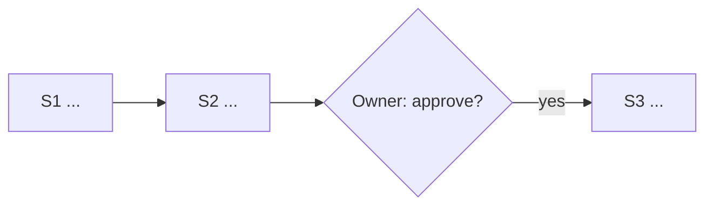
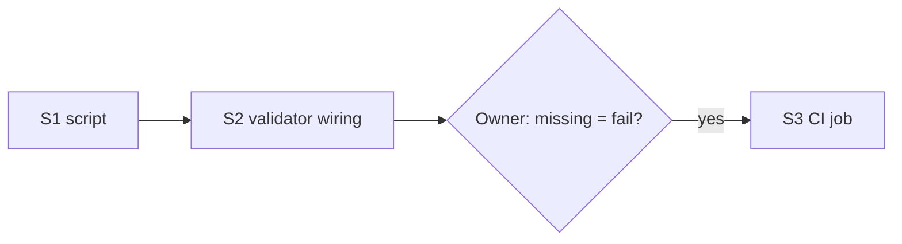

# Output Frame

**On-demand reference, not always-loaded.** Every entry file (`AGENTS.md` — also
read by GitHub Copilot —, `GEMINI.md`, `.agents/rules/output-frame.md`, and
the 4 per-tool pointer files; list in `scripts/core_blocks.manifest`)
already carries the short
`<!-- OUTPUT-FRAME:CORE -->` block. Read this file only when you need the
edge cases or the worked examples below — don't load it on every session
start (it would duplicate the core block). Plan and rationale:
`tasks/plans/agent-output-tldr-format.md`.

## Purpose

Put the summary where the owner's eyes land, so they can stop scrolling:
a header that says what the reply is and how sure the agent is, and — on
long replies — a footer that compacts what's above it (the bottom in chat,
the top in a file). The frame is **sized to the reply**: a 5-line block on
a 1-line answer makes scrolling worse, not better.

## Sizing

Sized by rendered line count (the model can see its own lines; it can't
count tokens) plus a structural test. Any condition in a row qualifies.

| Size | Test | Header | Footer |
|---|---|---|---|
| **S** | < ~25 lines and no `##` headings | none | none |
| **M** | 25–80 lines, or ≥3 headed sections, or a report of changes across ≥2 files | compact (1 line) | TL;DR |
| **L** | Any plan (multi-step, phased, PR sequence; plan mode; anything written to `tasks/plans/`), or > ~80 lines | full (5 lines) | TL;DR + Index + Flow |
| **L+** | (L and > ~150 lines) **or** the body is likely to be revised, re-referenced by a later turn/session, or handed off — **and** the harness can write files | full, in chat | body → file (see "Long bodies"); chat = header + footer + path |

When in doubt between two sizes, pick the smaller one.

## Header

**Full header (L, L+):**
```yaml
SYSTEM INSTRUCTION: MODE [<MODE>] ACTIVE
STATUS: <what this reply delivers, ≤12 words>
RESONANCE: [Confidence: <0-10>/10] | [Focus: <primary concept>] | [Entropy: Stable|High]
ANALYSIS: <one line: the owner's intent as understood>
TIMESTAMP: <ISO 8601 from the harness/env; date-only if no clock is known; never invented>
```

**Compact header (M)** — one line:
`MODE [<MODE>] · STATUS: <≤12 words> · Confidence <n>/10 · Entropy: Stable|High · <YYYY-MM-DD>`

**Field rules** (these keep the header from being decoration):
- **MODE:** the active skill/persona's mode if one is loaded (e.g.
  `ARCHITECT_ANALYST`, `DIAGRAM_ARCHITECT`); otherwise one of
  `ANSWER | RESEARCH | PLAN | BUILD | REVIEW | DEBUG | OPS`.
- **Confidence:** 9–10 verified this turn (the agent ran it or read it) ·
  6–8 consistent with the evidence but not executed · 3–5 partly inferred ·
  0–2 a guess.
- **Entropy:** `High` only when an unresolved contradiction or open
  question would change the result. Otherwise `Stable`.
- **TIMESTAMP / date:** from the harness or environment. If none is known,
  date-only; never invent a time.
- **Field names always stay English**, so they're grep-able.

## Footers

Every footer **compacts what's above it**: it adds nothing new, only
restates claims already made in the reply. It opens with a `---` rule and
is written in the language the owner used in the conversation (PT if they
wrote PT). It goes at the end because in a terminal or chat the reader's
eyes land on the **last** screen.

**M footer — TL;DR** (≤5 lines plus `Needs you`):
```
---
**TL;DR**
- <result, one line>
- <what changed / was decided (paths, PR, card)>
- <risk or caveat, only if one exists>
**Needs you:** <decision line(s) — see "Relation to the autonomy charter"> | none
```

**L footer — TL;DR + Index + Flow:**
````
---
## TL;DR
- <3–5 bullets: what, recommendation, cost/size, what's next>

## Index
1. <heading text verbatim> — <≤10-word gist>
2. …

## Flow
Path: S1 → S2 → (S3 ∥ S4) → S5 ⟂ owner:Q1

**Needs you:** <…> | none
````

**Index rule:** headings copied word for word and in order, so the owner
can jump with Ctrl-F (chat has no anchors). Every `##` in the body gets
exactly one index line.

## Flow

- **Plans:** nodes are execution steps or PRs, labelled `<id> <≤5 words>`;
  `-->` means "depends on", in execution order; parallel steps branch out
  and merge back; **a diamond marks every point where the owner must
  decide** (this is what makes the diagram worth more than the index). At
  most 3 `subgraph`s, only when the plan has named phases.
- **Non-plan L outputs** (research, reviews, debugging): question → key
  findings → conclusion/recommendation. **If there's no sequence or
  causality (e.g. a reference table), leave the Flow out.** Never draw a
  diagram for its own sake.
- **Mermaid safe subset:** `flowchart LR` up to 6 nodes, `TD` above; ≤12
  nodes; IDs match `[A-Z0-9_]`, every label a quoted string; only `-->`,
  `-.->`, `-->|label|` and `{}` diamonds; no `classDef`, styling or icons.
- **Always paired with the one-line `Path:` arrow summary.** Terminal
  harnesses (Claude Code CLI, Copilot CLI, Gemini CLI, Codex) print Mermaid
  as raw source, so `Path:` is what they actually show. The Mermaid block
  pays off where it renders: VS Code chat, GitHub, saved plan files.
- Inline footer Flow diagrams are exempt from `mermaid.instructions.md`'s
  `.mmd`-file and validator rules (see its "Scope" section), but still use
  this subset, and still call `mermaid-diagram-validator` where it exists
  (VS Code Copilot).

## Long bodies → file (every harness), Artifact (Claude only, optional)

**L+ baseline, every harness:** write the body to a file —
- a plan for a task → `tasks/plans/<slug>.md`;
- reference material → `docs/`;
- throwaway material → the session scratchpad.

**Inside the file, the summary moves to the top:** header, then TL;DR +
Index + Flow, then the body. Same principle as the chat footer — "put the
summary where the reader's eyes land" — which is the bottom in chat and the
top in a file. The chat reply is then only: full header, the same footer,
and `Full text: <path>`.

Why a file is worth it (not "fewer tokens this turn" — the Write call's
input still carries the full body, and an inline reply is in context either
way):
1. **Revise with a targeted Edit** instead of re-emitting the whole body.
2. **It survives `/compact`/`/clear`** as a path that can be re-read on
   demand ("restorable compression" — structured note-taking).
3. **A subagent that writes the file itself** only returns its summary to
   the main session — the one variant that actually shrinks the main
   context in the same turn. Prefer it for L+ research/plan bodies when the
   harness supports subagents.

So: revise long bodies with targeted file edits, never by re-emitting them;
refer back to them by path + heading.

**Claude Artifact — Claude Code only, never the default.** Publish one only
when the content is actually visual or interactive (use the
`artifact-design`, `artifact-diagramming`, `dataviz` skills), or the owner
asks. The page carries the same frame (header at the top, then
TL;DR/Index/Flow, then the body); the chat reply is header + footer + link.
No Artifact tool → fall back to the file baseline. Why not the default:
Artifacts only exist on Claude surfaces (other harnesses would get a
different system), aren't in git or grep-able by a later session, and don't
reduce generation tokens.

**Harness can't write** (read-only, plan mode): send the body inline. In
Claude Code plan mode, the plan text is the L output and carries the full
frame.

**Cache note:** header and footer are appended at the end of an
already-generated reply, so they never invalidate an earlier cached prefix;
they cost 25–300 output tokens once, then are re-read at the cached rate.
Justify them on readability, not caching. The core block itself must stay
**static** (no dates, counters, per-machine values) because it sits in every
session's cached prefix.

## Relation to the autonomy charter

Same primitive — a bottom-line block written for the owner — shown at two
triggers:

| Trigger | Owned by | What is shown |
|---|---|---|
| End of an M/L output (decision needed or not) | this file | header + TL;DR (or TL;DR + Index + Flow) + `Needs you:` |
| Escalation interrupt (T1–T8) | charter (`autonomy.instructions.md`) | the ≤5-line `DECISION …` BLUF **is the whole message** — no header, no footer |
| Completion report | charter | `DONE <task-id>: …` one-liner, treated as an S reply |

- `Needs you:` defines no format of its own: emit the charter's `DECISION`
  lines word for word, one per pending decision.
- **Fallback until the charter merges** (`tasks/plans/agent-autonomy-charter.md`,
  PR #75): `Needs you: <question> → recommend <X>; if silent: <default>` —
  same fields, so switching over is a text substitution.
- A `DECISION` line inside a footer triggers the same `tasks/escalate.py`
  event as a standalone interrupt.
- One drift check covers both marker blocks: `scripts/check_core_blocks.sh`.

## Persona extension

The **archi family** (`archi` + the 6 HITs skills and their
`task-personas/*.md`) keeps its behaviour through one allowed override:
**always use the full header, even on S replies, and add a 6th line**:
```yaml
DIALECTIC: [Tension: <0-10>] | [Antithesis: <brief counter-point or risk>]
```
Personas reference this file in 3 lines instead of carrying their own copy:
```
Header: inherits OUTPUT-FRAME (~/.agents/instructions/workspace-config/output-frame.instructions.md).
MODE = `<X>`; Focus default = `<Y>`.
Persona extension = archi-family (always full header + DIALECTIC).
```
Any other persona that needs a different frame declares its extension the
same way — never by pasting a modified copy of the header.

## Exemptions

No frame on: agent-to-agent messages (subagent reports, tool inputs);
commit messages and PR bodies; code or command output the owner asked for
verbatim; escalation BLUFs; any reply where the owner asked for a different
format.

## Worked example — M

Prompt: "summarise the last 5 commits" (~30 lines of reply).

```
MODE [ANSWER] · STATUS: summary of the last 5 commits on main · Confidence 9/10 · Entropy: Stable · 2026-09-24

## Tasks
- 6d99e07 — KV-cache addendum folded into the Output Frame plan …
…
## Docs
…
## Infra
…

---
**TL;DR**
- 5 commits, all on the Output Frame plan and its task cards.
- No code changed; only `tasks/` and `tasks/plans/agent-output-tldr-format.md`.
**Needs you:** none
```

## Worked example — L

Prompt: "plan how to add a drift check for the core blocks".

````
SYSTEM INSTRUCTION: MODE [PLAN] ACTIVE
STATUS: 3-step plan for a shared core-block drift check
RESONANCE: [Confidence: 7/10] | [Focus: One script, many marker names] | [Entropy: Stable]
ANALYSIS: Owner wants CI to fail when any inlined core block drifts from its siblings
TIMESTAMP: 2026-09-24

## 1. Script
…
## 2. Wiring
…
## 3. CI
…

---
## TL;DR
- One script, `scripts/check_core_blocks.sh <MARKER>...`, compares every copy byte for byte.
- Wired into `validate_dotfiles.sh` and a CI job; ~40 lines total.
- Next: owner picks whether a missing block is a failure or a warning.

## Index
1. Script — marker extraction and byte comparison
2. Wiring — call from validate_dotfiles.sh
3. CI — new workflow job

## Flow
Path: S1 script → S2 wiring → S3 CI ⟂ owner:Q1

**Needs you:** Missing block = fail or warn? → recommend fail; if silent: fail
````
