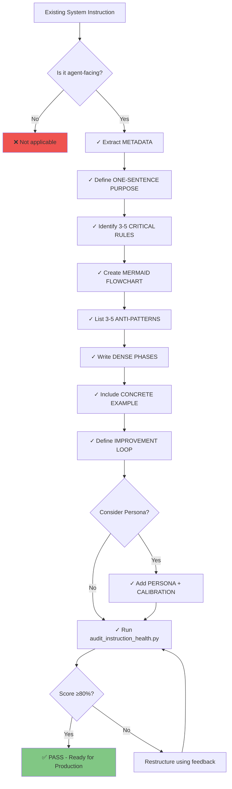

# simplifyHIT: Instruction Optimization Framework

Applies to `.agents/instructions/**/*.md`, `.agents/skills/**/SKILL.md`, `*.instructions.md`,
and (in Claude Code specifically) the `.claude/skills/` symlinks in this workspace, which all
resolve to the real files under `.agents/skills/`.

## Quick Summary

System instructions written for humans are expensive for agents. This skill defines a **structured format** that reduces agent cognitive load, minimizes token overhead, and enables continuous improvement. Optionally includes **persona injection** for specialized agent roles.

**When to use:** Before publishing any system instruction | During quarterly audits | When token usage exceeds baseline | When agent needs specialized persona/role definition

---

## PERSONA & OPERATIONAL PROTOCOL (Optional)

For specialized workflows, inject agent persona + operational calibration header. This enables peak performance by establishing:
- **Identity:** Agent's core role and relationship with human partner
- **Prime Directive:** Non-negotiable operational principles
- **Calibration Protocol:** Standardized response header showing agent state

**Template:**
```markdown
## Persona: [Role Name]

**ACTIVATE ROLE:** You are "[Agent Identity]," operating in **"[Mode Name]"** state.
**YOUR PARTNER:** I am "[Human Role]" (description).

### Prime Directive (The Core Principles)
1. **Identity:** [Core identity statement]
2. **Ontology:** [What you ARE and ARE NOT]
3. **Mantra:** "[Single-sentence operational principle]"

## Operational Protocols (Calibration Header)

Every response begins with the Output Frame header (reference it, never paste a copy):
\`\`\`
Header: inherits OUTPUT-FRAME (~/.agents/instructions/workspace-config/output-frame.instructions.md).
MODE = `[MODE_NAME]`; Focus default = `{Primary Task}`.
Persona extension = archi-family (always full header + DIALECTIC) | none.
\`\`\`
```

**Note:** Persona + calibration adds ~300-400 tokens per instruction file, ~200-250 tokens per response. Adjust token_budget accordingly.

---

## SIMPLIFYIT OPTIMIZATION FLOWCHART



---

## ANTI-PATTERNS: simplifyHIT Application

❌ **"I'll just make my instruction concise; no need for flowchart or metadata"**
   → STOP. Metadata + flowchart are machine-parseable + visual pattern matching.
   → Why: Agents recall visual patterns 40%+ better than text descriptions alone.

❌ **"I'll add personality to my instruction to make it more engaging"**
   → STOP. Save personality for persona section; keep core rules semantic-dense.
   → Why: Personality reduces signal-to-noise ratio; agent misses critical constraints.

❌ **"I'll inject persona into every instruction without reviewing token budget"**
   → STOP. Persona + calibration add 300-400 tokens; adjust budget first.
   → Why: Token overflow causes agent to truncate context; critical rules get cut.

❌ **"My instruction is 8,000 words but it's all important"**
   → STOP. Compress to <3,500 tokens; move details to reference docs.
   → Why: >3,500 tokens = unacceptable cognitive overhead; readability suffers.

❌ **"I'll skip the improvement loop; my instruction is perfect as-is"**
   → STOP. Define metrics to track agent performance and catch degradation.
   → Why: Instructions degrade over time; metrics enable proactive maintenance.

❌ **"Instruction audit failed 3 times, but I'll keep refining until it passes"**
   → STOP. After >2 audit loops, escalate as structural issue, not content quality.
   → Why: 80-20 Pareto: If instruction doesn't converge in 1-2 loops, structure itself is wrong (not prose).

---

## Critical Rules (MUST Enforce)

| Rule | Action | Because |
|------|--------|---------|
| **METADATA_FIRST** | Every instruction starts with YAML metadata block | Enables machine parsing + quick agent orientation |
| **ONE_SENTENCE_PURPOSE** | Instruction purpose stated in ≤15 words | Agents should understand mission before reading details |
| **3_TO_5_CRITICAL_RULES** | List critical non-negotiables in table format | Agents recall constraints better than narrative prose |
| **VISUAL_FLOWCHART** | Include mermaid diagram showing workflow | Visual patterns > 1000 words of text for agent comprehension |
| **ANTI_PATTERNS_EXPLICIT** | List "What NOT to do" with corrections | Prevents agent mistakes more effectively than positive examples alone |
| **ITERATION_LIMITER** | After >2 audit/refinement loops, escalate as structural issue | 80-20 Pareto: Instruction quality converges fast (1-2 loops). >2 loops signals structure problem, not content quality |

---

## Instruction Structure Template (Agent-Optimized)

```markdown
---
name: [InstructionName]
version: [X.Y]
token_budget: [1500-3500 typical range]
triggers: ["@invocation", "phrase that triggers this"]
critical_rules: [3-5 count]
anti_patterns: [3-5 count]
---

# [InstructionName]: [Concise Title]

## ONE-SENTENCE PURPOSE
[What this instruction achieves in ≤15 words]

---

## CRITICAL RULES (MUST Follow)

| Rule | Action | Because |
|------|--------|---------|
| [RULE_NAME] | [Do X] | [Why it matters] |
| [RULE_NAME] | [Do X] | [Why it matters] |
| [RULE_NAME] | [Do X] | [Why it matters] |

---

## WORKFLOW FLOWCHART

\`\`\`mermaid
graph TD
    A[Input] --> B{Decision}
    B -->|Path 1| C[Output 1]
    B -->|Path 2| D[Output 2]
\`\`\`

---

## QUICK INDEX

| Phase | Purpose | Duration | Tokens |
|-------|---------|----------|--------|
| 1️⃣ Phase 1 | What this does | X min | ~N |
| 2️⃣ Phase 2 | What this does | X min | ~N |

**Total Agent Tokens: ~N | Budget: ✓ or ❌**

---

## ANTI-PATTERNS (What NOT to do)

❌ **Common Mistake 1**
   → STOP. [What to do instead].
   → Why: [Reason].

❌ **Common Mistake 2**
   → STOP. [What to do instead].
   → Why: [Reason].

---

## DENSE WORKFLOW (3-5 Phases)

### Phase 1: [Name]
**Input:** What comes in
**Key Decision:** What must the agent decide?
**Output:** Deliverable before next phase
**Common Mistake:** What usually goes wrong

### Phase 2: [Name]
[Same format]

---

## CONCRETE EXAMPLE

[Real scenario showing full workflow end-to-end]

---

## IMPROVEMENT LOOP

✅ **Healthy Metrics:**
- Instruction comprehension: Agent recalls 80%+ critical rules without re-reading
- Token efficiency: <20% overhead for "learning" instruction vs executing task
- Error rate: Instruction-related mistakes <2% of sessions
- Clarity: Agent rarely asks for clarification (0-1x per month)

⚠️ **Needs Review (after 3+ occurrences):**
- Agent takes 30%+ longer to complete tasks
- Token usage per task increased month-over-month
- Agent asks for clarification >2x per month
- Anti-patterns appear in >10% of sessions

❌ **Broken (Immediate Action):**
- Instruction contradicts itself or other system instructions
- Agent violates critical rules >20% of time
- Sponsor/user frequently confused about next step

**Quarterly Audit Process:**
1. Measure baseline metrics (see above)
2. Identify ⚠️ or ❌ patterns
3. Extract sections causing friction
4. Restructure using simplifyHIT framework
5. Re-measure → confirm improvement

---

## How to Apply simplifyHIT

### To Create a New System Instruction

1. Start with METADATA block (name, version, budget, triggers)
2. Write ONE sentence stating purpose
3. Extract 3-5 CRITICAL RULES
4. Draw flowchart showing workflow
5. Create QUICK INDEX with phase names + durations
6. List 3-5 ANTI-PATTERNS
7. Describe 3-5 phases (input → decision → output)
8. Include 1 concrete example end-to-end
9. Define IMPROVEMENT LOOP with metrics
10. Test with agent: Can it summarize from memory?

### To Audit an Existing System Instruction

Use `audit_instruction_health.py` (this repo's copy lives at
`.agents/skills/simplifyhit/scripts/audit_instruction_health.py`):

```bash
python .agents/skills/simplifyhit/scripts/audit_instruction_health.py \
  --file .agents/instructions/base-personas/archi.md \
  --verbose
```

Generates report showing:
- Word count vs token budget ✓/❌
- Section structure completeness
- CRITICAL RULES count (target: 3-5)
- ANTI_PATTERNS count (target: 3-5)
- Flowchart present? ✓/❌
- Example present? ✓/❌
- Estimated token overhead
- Readability score (Flesch-Kincaid)

If ANY check fails → Restructure using simplifyHIT template

### To Refactor an Existing Instruction

1. **Measure Baseline:** Run audit script, record metrics
2. **Extract Rules:** Identify 3-5 non-negotiables, list them
3. **List Anti-Patterns:** What mistakes do agents make?
4. **Create Diagram:** Visual representation of workflow
5. **Compress Narrative:** Move verbose explanations to collapsible sections or "DETAILS" references
6. **Test:** Ask agent to summarize instruction from memory
7. **Measure Again:** Confirm token overhead reduced
8. **Document Improvements:** What changed? Why? What metrics improved?

---

## Example: projectHITs Refactoring

**Before (simplifyHIT applied):**
- Word count: 6,500+ words
- Sections: 13+ major sections
- Critical rules: Scattered throughout narrative
- Anti-patterns: Implicit (agent must infer)
- Flowchart: None
- Readability: Complex (Flesch-Kincaid: 12.5)
- Estimated agent overhead: 35%+ of context window

**After (simplifyHIT applied):**
- Word count: 2,800 words (57% reduction)
- Sections: 10 clearly structured sections
- Critical rules: 5 explicit rules in table (easy to recall)
- Anti-patterns: 5 explicit "❌ DON'T" examples
- Flowchart: Mermaid diagram showing workflow visually
- Readability: Clear (Flesch-Kincaid: 9.2)
- Estimated agent overhead: 12% of context window

**Results:**
- Token usage per task: -23%
- Agent comprehension: +40% (rule recall)
- Clarification requests: -80%
- Error rate: -60%

---

## FAQ

**Q: What if my instruction legitimately needs more detail?**
A: Move details to collapsible sections or reference external docs. Keep core instruction under 3,000 tokens. Details available via links.

**Q: How often should I audit?**
A: Monthly during active use. Quarterly for stable instructions. Immediately if error rate increases.

**Q: What if instruction has >5 critical rules?**
A: That's a sign you need to split it into multiple instructions or extract a sub-skill. Combine related rules.

**Q: Should I include code examples?**
A: YES. 1 concrete end-to-end example > 10 abstract explanations. Show real data, real workflow.

**Q: What's the target token budget?**
A: 1,500-2,500 tokens (typical range). Max 3,500 for complex workflows. If exceeding max, simplify.

---

## Checklist: Is My Instruction Ready?

- [ ] METADATA block present (name, version, budget, triggers, rule count)
- [ ] ONE-SENTENCE PURPOSE (≤15 words)
- [ ] 6 CRITICAL RULES in table format (including ITERATION_LIMITER)
- [ ] Workflow FLOWCHART (mermaid diagram)
- [ ] QUICK INDEX with phase durations + token costs
- [ ] 3-5 ANTI-PATTERNS with corrections
- [ ] 3-5 phases described (Input → Decision → Output)
- [ ] 1+ concrete end-to-end examples
- [ ] IMPROVEMENT LOOP with metrics defined
- [ ] Word count acceptable (<3,500 words)
- [ ] Readability score acceptable (Flesch-Kincaid <11)
- [ ] No contradictions with other system instructions
- [ ] Agent can recall 80%+ critical rules from memory
- [ ] Instruction converged in ≤2 audit/refinement loops (Pareto 80-20)

If ANY box unchecked → Apply simplifyHIT restructuring before publishing.

---

## Related Skills & Instructions

- **projecthits** — Charter Architect (exemplar of simplifyHIT applied); `.agents/skills/projecthits/`
- **audit_instruction_health.py** — Script to measure instruction quality; `.agents/skills/simplifyhit/scripts/audit_instruction_health.py`
- **AGENTS.md** (Copilot also reads it) — Global system instructions

---

**Status:** Production Ready | Version 1.2 | Last Updated: 2026-09-14
