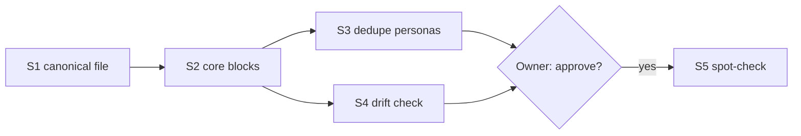
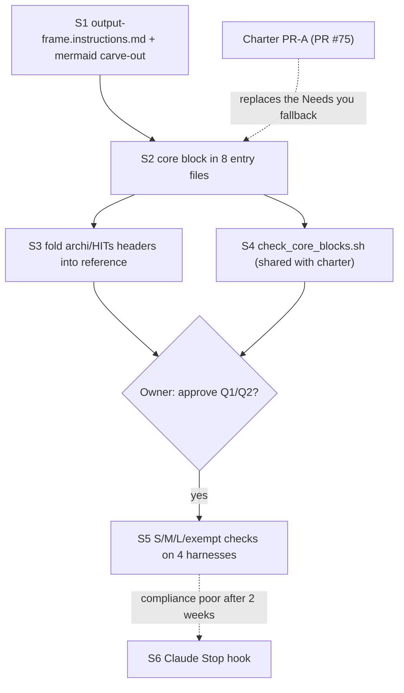

# Plan: The "Output Frame" — header + footer standard for every agent output

**Status: plan ready for owner approval, nothing implemented.** Produced by
a dedicated Opus session in Claude Code's Plan mode (2026-09-24), reading
the actual repo state (existing header copies, pointer-file chain, the
`mermaid.instructions.md` rule, the unmerged autonomy-charter branch)
rather than designing from the request text alone. Task card:
`dotfiles-tsk-agent-output-tldr-format`.

```yaml
SYSTEM INSTRUCTION: MODE [PLAN] ACTIVE
STATUS: Output-frame design ready for owner approval (nothing implemented)
RESONANCE: [Confidence: 8/10] | [Focus: One header+footer standard for every harness] | [Entropy: Stable]
ANALYSIS: The owner wants a header like archi's on every output, and a compact closing summary on long outputs so they can stop scrolling
TIMESTAMP: 2026-09-24
```

## 0. What the repo showed that changes the brief

1. **Archi is not the only skill with this header. About 15 files already have their own copy, and the copies have drifted apart.**
   - Skills with it: `archi`, `diagramhits`, `mockuphits`, `projecthits`, `presenthits`, `documenthits`, `reviewhits`. Each one's `SKILL.md` has a "Biofeedback Header (RESONANCE)" section with 5 fields.
   - The 6 task personas in `.agents/instructions/task-personas/*.md` each have their own MODE name, for example `[DIAGRAM_ARCHITECT]`.
   - Also: `_templates/agent-template.md`, `_templates/agent-README.md`, `.agents/workflows/architect_html_sciml.md`, and `simplifyhit/SKILL.md` (which misspells the field as `RESSONANCE`).
   - The master persona `.agents/instructions/base-personas/archi.md` has **6** fields: it adds `DIALECTIC: [Tension] | [Antithesis]`, and it uses a bold blockquote instead of a code block.
   - So the job is to **merge one family of drifted copies into one canonical definition**, not to copy one skill's header everywhere.
2. **Putting the rule in `AGENTS.md` alone would not reach every harness.** The repo-root `AGENTS.md` is only loaded when an agent works inside `~/dotfiles`. The instructions that apply in every repo come from the per-tool pointer files: `~/.claude/CLAUDE.md`, `~/.gemini/GEMINI.md`, `~/.codex/AGENTS.md` and `~/.copilot/copilot-instructions.md`. All of them say "read every `*.instructions.md` in `.agents/instructions/workspace-config/`". Whether non-Claude tools actually follow that pointer is **unverified** (the autonomy-charter plan §0/§8 notes the same gap). So this design uses the pattern the charter already chose:
   - the full text lives in one canonical `workspace-config/*.instructions.md` file;
   - a short "core block" is copied between markers into every entry file.
3. **One existing rule clashes with this.** `workspace-config/mermaid.instructions.md` (Rules 1, 2 and 5) says "write diagrams to `.mmd` files; always call `mermaid-diagram-validator`; never return unvalidated Mermaid". Those tools only exist in VS Code Copilot, and a footer diagram is not a diagram deliverable. That file needs a scope carve-out, or every footer breaks the rule.
4. **The autonomy charter is not merged yet.** Its plan is only on branch `claude/agent-autonomy-charter` (draft PR #75, `tasks/plans/agent-autonomy-charter.md`). It already defines a 5-line BLUF template ("bottom line up front", `DECISION <task-id> [Tn,Pn]: …`) and a `DONE` one-liner. This design reuses those templates instead of defining new ones (see §5).

## 1. Decision: the header

**Where it goes.** The canonical text goes in a new file, `.agents/instructions/workspace-config/output-frame.instructions.md` (`applyTo: "**"`, about 90 lines). A core block of about 14 lines, between `<!-- OUTPUT-FRAME:CORE BEGIN/END -->` markers, is copied into:
- a new section `## Output frame (every agent, every repo)` in `AGENTS.md`, directly after "Workspace standards";
- the 4 global pointer files: `.claude/CLAUDE.md`, `.gemini/GEMINI.md`, `.codex/AGENTS.md`, `.copilot/copilot-instructions.md`;
- repo-level `GEMINI.md` and `.github/copilot-instructions.md`;
- a new `.agents/rules/output-frame.md` (Antigravity only reads `.agents/rules/*.md`).

This is the same 8-target placement as the charter's `AUTONOMY:CORE` block, with its own markers so the two never conflict.

**Threshold: the header is sized to the reply, not added to every reply.** The owner's pain is scrolling, and a 5-line block on a 1-line answer makes that worse. Replies are sized by line count, because the model can see its own lines as it writes but cannot count tokens.

| Size | Test (any condition qualifies) | Header | Footer |
|---|---|---|---|
| **S** | Under about 25 rendered lines and no `##` headings (fits on one terminal screen) | none | none |
| **M** | 25–80 lines, or 3 or more headed sections, or a report of changes across 2 or more files | compact 1-line header | TL;DR |
| **L** | Any plan (multi-step, phased, or a PR sequence; plan mode; anything written to `tasks/plans/`), or more than about 80 lines | full 5-line header | TL;DR + Index + Flow |
| **L+** | L and more than about 150 lines, and the harness can write files | full header in chat | body goes to a file (§4); chat gets header + footer + link |

**Full header (L).** The field names are archi's exactly, as the owner asked:
```yaml
SYSTEM INSTRUCTION: MODE [<MODE>] ACTIVE
STATUS: <what this reply delivers, ≤12 words>
RESONANCE: [Confidence: <0-10>/10] | [Focus: <primary concept>] | [Entropy: Stable|High]
ANALYSIS: <one line: the owner's intent as understood>
TIMESTAMP: <ISO 8601 from the harness/env; date-only if no clock is known; never invented>
```

**Compact header (M).** One line:
`MODE [<MODE>] · STATUS: <≤12 words> · Confidence <n>/10 · Entropy: Stable|High · <YYYY-MM-DD>`

**Field rules.** These keep the header from being decoration:
- **MODE:** the active skill or persona's mode if one is loaded (for example `ARCHITECT_ANALYST` or `DIAGRAM_ARCHITECT`). Otherwise one of `ANSWER | RESEARCH | PLAN | BUILD | REVIEW | DEBUG | OPS`.
- **Confidence:**
  - 9–10: verified this turn (the agent ran it or read it);
  - 6–8: consistent with the evidence but not executed;
  - 3–5: partly inferred;
  - 0–2: a guess.
- **Entropy:** `High` only when an unresolved contradiction or open question would change the result.
- **Field names always stay English**, so they are grep-able.

**Persona extension.** The archi family (archi plus the 6 HITs skills) keeps its current behaviour through one allowed override: always use the full header, even on S replies, and add a 6th line, `DIALECTIC: [Tension: 0-10] | [Antithesis: …]`. That is how today's archi behaviour survives without forcing it on every agent.

## 2. Decision: the footers

**The rule for every footer: it compacts what is above it.** It adds nothing new and only restates claims already made in the reply. It opens with a `---` rule. It is written in the language the owner used in the conversation (PT if they wrote PT). Why a footer rather than a top summary: in a terminal or chat, the reader's eyes land on the **last** screen.

**M footer: TL;DR**
```
---
**TL;DR**
- <result, one line>
- <what changed / was decided (paths, PR, card)>
- <risk or caveat, only if one exists>
**Needs you:** <decision line(s) — see §5> | none
```
At most 5 lines plus "Needs you".

**L footer: TL;DR + Index + Flow**
````
---
## TL;DR
- <3–5 bullets: what, recommendation, cost/size, what's next>

## Index
1. <heading text verbatim> — <≤10-word gist>
2. …

## Flow
Path: S1 → S2 → (S3 ∥ S4) → S5 ⟂ owner:Q1

**Needs you:** <…> | none
````

**Index rule.** Headings are copied word for word and in order, so the owner can jump with Ctrl-F; chat has no anchors. Every `##` in the body gets exactly one index line.

## 3. Decision: what the Flow diagram shows, and in what format

- **Content (plans):**
  - nodes are the execution steps or PRs, labelled `<id> <≤5 words>`;
  - `-->` means "depends on", in execution order;
  - parallel steps branch out and merge back;
  - **diamond nodes mark every point where the owner must decide.** This is what makes the diagram worth more than the index: it shows where the plan waits on the owner.
  - At most 3 `subgraph`s, and only when the plan has named phases.
- **Content (non-plan L outputs such as research, reviews or debugging):** question → key findings → conclusion/recommendation. **If the output has no sequence or causality (a reference table, for example), leave the Flow out.** Never draw a diagram for its own sake.
- **Format:** **Mermaid is confirmed**, since `diagramhits`/`archi` already use it and GitHub renders it in `tasks/plans/*.md`. It is limited to a safe subset:
  - `flowchart LR` for up to 6 nodes, `TD` above that;
  - at most 12 nodes;
  - IDs match `[A-Z0-9_]`, and every label is a quoted string;
  - only `-->`, `-.->`, `-->|label|` and `{}` diamonds;
  - no `classDef`, styling or icons.
- **It always comes with the one-line `Path:` arrow summary.** Terminal harnesses (the Claude Code CLI, Copilot CLI, Gemini CLI and Codex) print Mermaid as raw source, so the `Path:` line is what they actually give the owner. The Mermaid block pays off wherever it renders: VS Code chat, GitHub, and saved plan files.
- **Carve-out in `mermaid.instructions.md`:** narrow Rules 1, 2 and 5 to "diagrams the user requests as a deliverable". Inline footer Flow diagrams are exempt from `.mmd` files and the validator tools, but still use the safe subset above, and still call the validator when it exists (VS Code Copilot).

## 4. Decision: Claude Artifacts. Not the default; a Claude-only extra on top of a file for every harness

**Position: do not make "long output = Artifact" the default.**

Why not:
- Artifacts only exist on Claude surfaces, so Copilot, Gemini, Antigravity and Codex would get a different system.
- An Artifact page is not in git, and a later session on another harness cannot grep it.
- It does not reduce **generation** tokens: the model still writes all of it.

What actually saves scrolling and re-reading is getting the long body **out of the chat stream**, and every harness can already do that with a file. So the design is:

- **L+ in every harness (the shared baseline).** Write the body to a file:
  - a plan for a task goes to `tasks/plans/<slug>.md` (the existing convention: the autonomy charter did exactly this);
  - reference material goes under `docs/`;
  - throwaway material goes to the session scratchpad.

  **Inside the file, the summary moves to the top**: header, then TL;DR + Index + Flow, then the body. The principle behind both placements: "put the summary where the reader's eyes land". That is the bottom in chat and the top in a file. It is also why the charter plan's top "TL;DR (PT)" is already correct for a file.

  The chat reply is then only: full header, the same footer, and `Full text: <path>`. Later turns cite the path instead of re-quoting the text; that is where the real token saving is.
- **Claude Code only, optional.** Publish an Artifact only when:
  - the content is actually visual or interactive (use the `artifact-design`, `artifact-diagramming` and `dataviz` skills); or
  - the owner asks for one.

  The page carries the same frame (header block at the top, then TL;DR/Index/Flow, then the body), and the chat reply is header + footer + link. If the Artifact tool is not available, the harness falls back to the file baseline, so no harness is left without a path.
- **If the harness cannot write** (read-only or plan mode): send the body inline. In Claude Code plan mode, the plan text is the L output and carries the full frame.

## 5. Decision: reconciling with `dotfiles-tsk-agent-autonomy-charter`. One primitive, two triggers, one template source

Both cards describe **the same primitive: a bottom-line block written for the owner**. They are two places to show it, not two features.

| Trigger | Owned by | What is shown |
|---|---|---|
| **End of an M/L output** (whether or not a decision is needed) | this card (`output-frame.instructions.md`) | Header plus TL;DR (or TL;DR + Index + Flow), with a closing **`Needs you:`** slot |
| **Escalation interrupt** (T1–T8) | charter (`autonomy.instructions.md`) | The ≤5-line `DECISION …` BLUF **is the whole message**, with no header and no footer; its first line acts as the header |
| **Completion report** | charter | The `DONE <task-id>: …` one-liner, treated as an S reply |

**How drift is prevented:**
- The `Needs you:` slot does not define its own format. It says: "emit the charter's `DECISION` lines word for word, one per pending decision".
- Until charter PR-A merges, the fallback is: `Needs you: <question> → recommend <X>; if silent: <default>`. That fallback has the same fields as the charter, so switching over is a text substitution.
- The charter's §6 fact `decision_needed` is unaffected: a `DECISION` line inside a footer triggers the same `tasks/escalate.py` event as a standalone interrupt.
- A shared drift check (§6, S4) covers both marker blocks.
- Why not keep them fully separate: the fields would diverge (options, recommendation, default, deadline), and the owner would learn two formats for one question: "what do you need from me?"

## 6. Decision: rollout and archi's fate

**Exempt from the frame everywhere:**
- agent-to-agent messages (subagent reports, tool inputs);
- commit messages and PR bodies;
- code or command output the owner asked for verbatim;
- escalation BLUFs;
- any reply where the owner asked for a different format.

**S1 (canonical text, L0 path), one PR:**
- New: `.agents/instructions/workspace-config/output-frame.instructions.md`, with sections Purpose · Sizing table · Header (full, compact, field rules) · Footers M/L · Flow spec · Long bodies → file/Artifact · Relation to autonomy charter · Persona extension · Exemptions · one worked M example and one L example.
- Add a row to the `.agents/instructions/README.md` table.
- Apply the `mermaid.instructions.md` carve-out from §3.
- Update the "Last Updated" line in `AGENTS.md`.

**S2 (core block in the 8 targets listed in §1).** The core block text:
```
<!-- OUTPUT-FRAME:CORE BEGIN -->
## Output frame (every human-facing reply; full text: ~/.agents/instructions/workspace-config/output-frame.instructions.md)
Size the reply: S = <~25 lines, no headings · M = 25–80 lines, ≥3 sections, or a multi-file change report · L = any plan, or >~80 lines.
- S: no frame.
- M: first line `MODE [X] · STATUS: … · Confidence n/10 · Entropy: Stable|High · <date>`; end with `---` + **TL;DR** (≤5 bullets that compact what's above, nothing new) + `Needs you: … | none`.
- L: full header (SYSTEM INSTRUCTION MODE / STATUS / RESONANCE / ANALYSIS / TIMESTAMP); end with TL;DR + Index (headings verbatim, in order) + Flow (`Path:` arrow line + ≤12-node mermaid flowchart: steps, dependencies, owner-decision diamonds; omit if no sequence) + Needs you.
- L >~150 lines and you can write files: body goes to a file (tasks/plans/, docs/, scratchpad; Claude Artifact only if visual or requested) with TL;DR+Index+Flow at its TOP; chat = header + footer + path.
- `Needs you:` uses the autonomy charter's DECISION line format. Escalation BLUFs, agent-to-agent messages, commits, PR bodies and verbatim output are exempt.
- Confidence: 9–10 verified this turn, 6–8 consistent-not-run, 3–5 inferred, ≤2 guess. Never invent a timestamp. Footer in the owner's language; header keys in English.
<!-- OUTPUT-FRAME:CORE END -->
```

**S3 (deduplicate the header family, L0).** Replace each duplicated header block with a 3-line reference: "Inherits OUTPUT-FRAME; MODE = `<X>`; Focus default = `<Y>`; persona extension = archi-family (always full header + DIALECTIC)". Files:
- `archi/SKILL.md` and `base-personas/archi.md`;
- the 6 HITs `SKILL.md` files and the 6 matching `task-personas/*.md`;
- `_templates/agent-template.md` and `_templates/agent-README.md`;
- `simplifyhit/SKILL.md` (this also fixes the `RESSONANCE` typo).

**Archi's header is folded in, not deprecated.** Its field set becomes the canonical header. Archi keeps only its MODE name and the DIALECTIC extension, so its behaviour does not change. Leave `.agents/workflows/architect_html_sciml.md` as it is: it is a standalone migrated prompt.

**S4 (drift check, L1).** Add `scripts/check_core_blocks.sh`, wired into `scripts/validate_dotfiles.sh` and CI. It fails if any `*:CORE` marker block differs between the 8 targets. Build it **as the generalised version of the charter's planned `check_autonomy_core.sh`**: one script that takes a list of marker names, so there are not two scripts. Later, both core blocks become `.agents/agentsmd/` fragments once unification PR6's `bin/agentsmd-render` exists.

**S5 (acceptance: spot-checks on each harness).** Run on Claude Code, Copilot CLI, Gemini CLI/Antigravity and Codex. Pass condition: all 4 prompts behave as expected on every harness.
- An S prompt ("where is sync.sh?") gets no frame.
- An M prompt ("summarise the last 5 commits") gets the compact header and a TL;DR.
- An L prompt ("plan feature X") gets the full header and TL;DR + Index + Flow.
- An exempt prompt ("write the commit message") gets no frame.

**S6 (conditional, after 2 weeks).** Only if Claude Code compliance is poor: add a `Stop` hook that detects a reply over 80 lines with no `TL;DR` and asks for the footer. Nothing like that ships in v1, because prose comes first and a hook costs a turn on every miss.

**Ordering:** S1 → S2 → (S3 ∥ S4) → S5 → (S6 if needed). This does not depend on the charter merging, thanks to the fallback `Needs you` format. If the charter's PR-A lands first, S2 edits the same 8 files but in a separate marker region.

**Cost:**
- a compact header is about 25 tokens;
- a full header is about 70 tokens;
- an M footer is about 60 tokens;
- an L footer is about 200–300 tokens, which is small next to L bodies of over 2k tokens.

**Main risks:**
- The model mis-sizes a reply. Mitigation: line thresholds plus a structural test (headings or a plan).
- Confidence becomes vanity. Mitigation: the rubric in the field rules.
- Mermaid breaks in terminals. Mitigation: the `Path:` line plus the safe subset.
- Non-Claude harnesses ignore the pointer files. Mitigation: the copied core block plus the S5 checks.

## 7. Owner redirect points (defaults already chosen)

- **Q1:** no frame at all on S replies (outside archi-family personas). The alternative is the compact header on everything. Recommended: no frame, for less noise.
- **Q2:** L+ (over about 150 lines) moves the body to a file by default. The alternative is inline plus footer only.

---
## TL;DR
- The header already exists as about 15 drifted copies (7 skills, 6 personas, templates). It becomes one canonical Output Frame in `.agents/instructions/workspace-config/output-frame.instructions.md`, with a 14-line core block copied into `AGENTS.md`, the 4 global pointer files, `GEMINI.md`, `.github/copilot-instructions.md` and `.agents/rules/output-frame.md`. `AGENTS.md` alone would only reach agents working inside `~/dotfiles`.
- Replies are sized by lines: S (under 25) gets no frame; M (25–80 lines) gets a compact 1-line header and a TL;DR footer; L (any plan, or over 80 lines) gets the full archi 5-line header and TL;DR + Index + Flow.
- Flow = a `Path:` arrow line plus a Mermaid flowchart of at most 12 nodes: steps, dependencies, and diamonds where the owner must decide. `mermaid.instructions.md` gets a carve-out.
- Artifacts are not the default. Over 150 lines, the body goes to a file with the summary at its top (every harness); an Artifact is a Claude-only option for visual content or on request.
- The escalation TL;DR from `dotfiles-tsk-agent-autonomy-charter` is the same primitive: the footer's `Needs you:` slot emits the charter's `DECISION` lines, and one drift-check script covers both blocks.
- Archi's header is folded in as the canonical header. Archi-family personas keep "always full header + DIALECTIC" as an allowed extension.

## Index
0. What the repo showed that changes the brief — header drift, pointer files, Mermaid clash, charter unmerged
1. Decision: the header — S/M/L/L+ sizing, templates, field rules
2. Decision: the footers — M TL;DR, L TL;DR + Index + Flow
3. Decision: what the Flow diagram shows — content, Mermaid subset, `Path:` line
4. Decision: Claude Artifacts — file for every harness, Artifact Claude-only
5. Decision: reconciling with the autonomy charter — one primitive, two triggers
6. Decision: rollout and archi's fate — S1–S6, files, exemptions, cost, risks
7. Owner redirect points — Q1 and Q2

## Flow
Path: S1 canonical file → S2 core blocks → (S3 dedupe personas ∥ S4 drift check) → owner Q1/Q2 → S5 checks on each harness → S6 hook only if needed

**Needs you:** Approve the plan as written, or redirect Q1 (no frame on S replies) / Q2 (L+ body goes to a file). Recommended: approve both. If you don't answer, the card stays in `planning`.

### Critical Files for Implementation
- `.agents/instructions/workspace-config/output-frame.instructions.md` (new, canonical)
- `AGENTS.md` (core block section after "Workspace standards"), plus the same block in `.claude/CLAUDE.md`, `.gemini/GEMINI.md`, `.codex/AGENTS.md`, `.copilot/copilot-instructions.md`, `GEMINI.md`, `.github/copilot-instructions.md`, and new `.agents/rules/output-frame.md`
- `.agents/instructions/workspace-config/mermaid.instructions.md` (scope carve-out)
- `.agents/skills/archi/SKILL.md` and `.agents/instructions/base-personas/archi.md` (fold-in; same edit pattern for the 6 HITs `SKILL.md` files, the 6 files in `.agents/instructions/task-personas/`, the files in `.agents/skills/_templates/`, and `.agents/skills/simplifyhit/SKILL.md`)
- `scripts/validate_dotfiles.sh` (wire in the new shared `scripts/check_core_blocks.sh`); for reconciling with the charter, see `tasks/plans/agent-autonomy-charter.md` on branch `claude/agent-autonomy-charter`, §4 and §5
