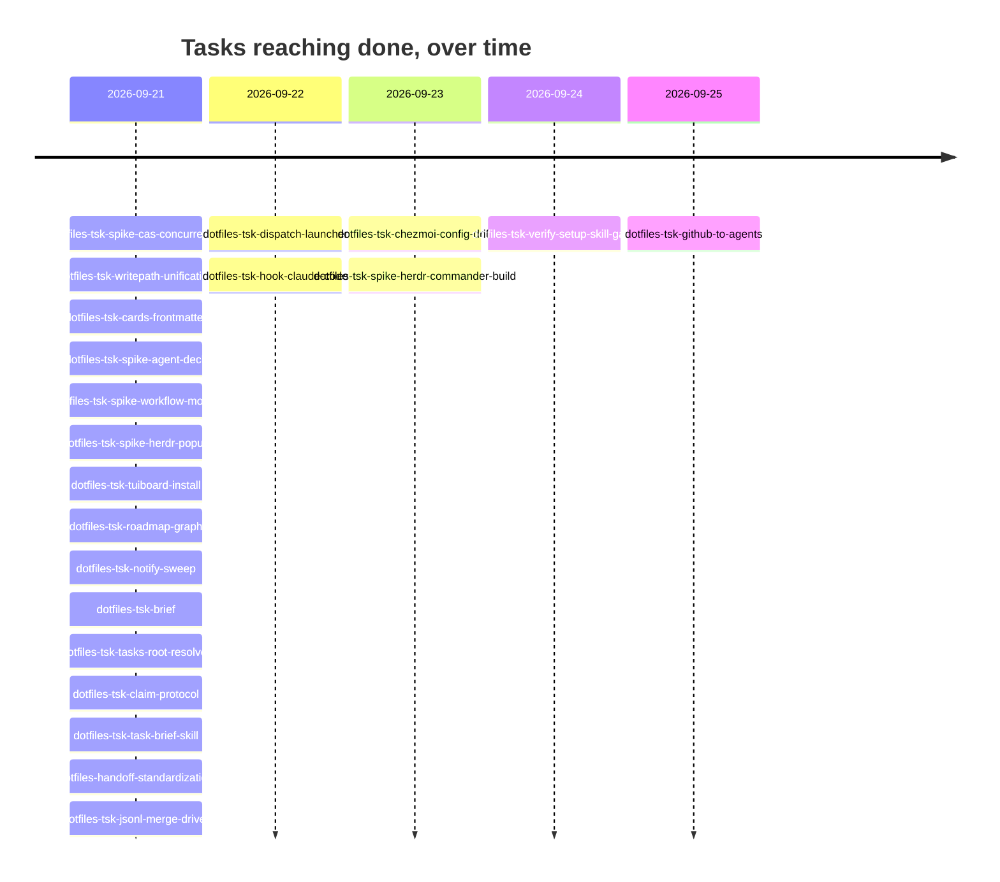

# roadmap.md

**Generated by `rebuild_graph.py` from `events.jsonl` — do not hand-edit.**
One subgraph per project, nodes classed by `tasks/lifecycle.py` phase.
No `blocked_by` dependency edges yet — `blocked_by` is still free prose in
the payload, not a list of task ids (see `dotfiles-tsk-graph-dependency-edges`).
`tasks/roadmap.mmd` carries the flowchart below as raw Mermaid source.

## Roadmap

```mermaid
flowchart LR
    classDef backlog fill:#eceff1,stroke:#607d8b,stroke-width:2px,color:#000;
    classDef planning fill:#e3f2fd,stroke:#1e88e5,stroke-width:2px,color:#000;
    classDef in_progress fill:#fff8e1,stroke:#f9a825,stroke-width:2px,color:#000;
    classDef review fill:#ede7f6,stroke:#7b1fa2,stroke-width:2px,color:#000;
    classDef validation fill:#e8f5e9,stroke:#2e7d32,stroke-width:2px,color:#000;
    classDef done fill:#c8e6c9,stroke:#1b5e20,stroke-width:2px,color:#000;
    classDef blocked fill:#ffebee,stroke:#c62828,stroke-width:2px,color:#000;
    classDef deferred fill:#f5f5f5,stroke:#9e9e9e,stroke-width:2px,color:#000;

    subgraph proj_Work_notes["Work/notes"]
        worknotes-repo-hygiene-worknotes["worknotes-repo-hygiene-worknotes<br/>Abrir PR: claude/repo-hygiene-worknotes"]:::done
        worknotes-workspace-standards-schema["worknotes-workspace-standards-schema<br/>Abrir PR: claude/workspace-standards-schema"]:::done
    end

    subgraph proj_architect["architect"]
        architect-repo-hygiene-architect["architect-repo-hygiene-architect<br/>Abrir PR: claude/repo-hygiene-architect"]:::done
        architect-workspace-standards-schema["architect-workspace-standards-schema<br/>Abrir PR: claude/workspace-standards-schema"]:::done
        architect-env-leak-fix["architect-env-leak-fix<br/>Abrir PR: claude/env-leak-fix"]:::done
    end

    subgraph proj_dotfiles["dotfiles"]
        dotfiles-repo-hygiene-dotfiles["dotfiles-repo-hygiene-dotfiles<br/>Abrir PR: claude/repo-hygiene-dotfiles"]:::done
        dotfiles-workspace-standards-schema["dotfiles-workspace-standards-schema<br/>Abrir PR: claude/workspace-standards-schema"]:::done
        dotfiles-todo-continuation-and-notes-backlog["dotfiles-todo-continuation-and-notes-backlog<br/>Abrir PR: claude/todo-continuation-and-notes-backlog"]:::done
        dotfiles-tsk-spike-agent-deck["dotfiles-tsk-spike-agent-deck<br/>Spike: install Agent Deck, confirm it detects Claude Code + Copilot CLI sessions side by side"]:::done
        dotfiles-tsk-spike-cas-concurrency["dotfiles-tsk-spike-cas-concurrency<br/>Spike: confirm git-ref compare-and-swap claiming survives concurrent writers"]:::done
        dotfiles-tsk-spike-workflow-model["dotfiles-tsk-spike-workflow-model<br/>Spike: confirm a Workflow script with a real per-phase model override runs as expected"]:::done
        dotfiles-tsk-spike-herdr-popup["dotfiles-tsk-spike-herdr-popup<br/>Spike: confirm a trivial herdr plugin can open a popup (herdr plugin pane open)"]:::done
        dotfiles-tsk-tuiboard-install["dotfiles-tsk-tuiboard-install<br/>Install tuiboard for real (not a scratch install), point it at tasks/kanban.md"]:::done
        dotfiles-tsk-roadmap-graph["dotfiles-tsk-roadmap-graph<br/>rebuild_graph.py: project events.jsonl into a Mermaid roadmap (tasks/roadmap.md + .mmd) - phases + per-project grouping + done timeline, no dependency edges yet"]:::done
        dotfiles-tsk-writepath-unification["dotfiles-tsk-writepath-unification<br/>lifecycle.py + LEGAL_TRANSITIONS + append() as the single writer, with CAS (Layer A)"]:::done
        dotfiles-tsk-notify-sweep["dotfiles-tsk-notify-sweep<br/>notify.py + sweep.py - the notification producer side"]:::done
        dotfiles-tsk-brief["dotfiles-tsk-brief<br/>brief.py - heartbeat + inbox consumer"]:::done
        dotfiles-tsk-hook-claude-code["dotfiles-tsk-hook-claude-code<br/>Claude Code SessionStart hook + versioned settings.json fragment"]:::done
        dotfiles-tsk-cpx-copilot["dotfiles-tsk-cpx-copilot<br/>cpx wrapper for Copilot CLI (its own sessionStart hook is broken)"]:::backlog
        dotfiles-tsk-hook-antigravity["dotfiles-tsk-hook-antigravity<br/>Antigravity hook (inherited hook mechanism)"]:::backlog
        dotfiles-tsk-task-brief-skill["dotfiles-tsk-task-brief-skill<br/>/task-brief skill - thin shell over brief.py"]:::done
        dotfiles-tsk-systemd-units["dotfiles-tsk-systemd-units<br/>ensure-tsk-sweep.sh + systemd units, following the existing ensure-*.sh convention"]:::backlog
        dotfiles-tsk-graph-dependency-edges["dotfiles-tsk-graph-dependency-edges<br/>Add blocked_by dependency edges to rebuild_graph.py's flowchart (needs blocked_by as a list, not prose)"]:::backlog
        dotfiles-tsk-cards-frontmatter["dotfiles-tsk-cards-frontmatter<br/>L1: markdown+YAML-frontmatter card per task (rebuild_cards.py, generated view, never hand-edited)"]:::done
        dotfiles-tsk-dispatch-launcher["dotfiles-tsk-dispatch-launcher<br/>tsk dispatch: launch a session on a provider with the task brief pre-loaded (claude &quot;<p>&quot;/--bg, copilot -i, agy -i) - push side of cross-provider handoff, pull side is dotfiles-tsk-brief"]:::done
        dotfiles-tsk-tasks-root-resolver["dotfiles-tsk-tasks-root-resolver<br/>tasks_root() resolver: one canonical write path for events.jsonl, the CAS lock and every rebuild_*.py (fixes 4 divergent copies + 1 orphaned event)"]:::done
        dotfiles-tsk-claim-protocol["dotfiles-tsk-claim-protocol<br/>L2: claim protocol in a separate claims.jsonl -- locked conditional appends, closed role vocabulary, atomic preemption, human preempts swarm"]:::done
        dotfiles-tsk-jsonl-merge-driver["dotfiles-tsk-jsonl-merge-driver<br/>Custom git merge driver (merge=union or equivalent) for tasks/*.jsonl so a conflict resolution can never silently drop an append-only line"]:::done
        dotfiles-tsk-archive-and-reorg["dotfiles-tsk-archive-and-reorg<br/>Archive done tasks out of live views + reorganize tasks/ directory tree so 'current' stays small (no infinite memory/context)"]:::planning
        dotfiles-handoff-standardization["dotfiles-handoff-standardization<br/>Adopt HANDOFF.md convention (global index + per-repo/subsystem), rename tasks/handoff.md"]:::done
        dotfiles-tsk-gh-path-recursion["dotfiles-tsk-gh-path-recursion<br/>Fix infinite recursion in ~/.local/bin/gh wrapper (duplicate PATH entry)"]:::review
        dotfiles-tsk-agent-os-pr2-pr7["dotfiles-tsk-agent-os-pr2-pr7<br/>Agent-OS unification: PR2-PR7 (docs/AGENT_OS_UNIFICATION_PLAN.md)"]:::backlog
        dotfiles-tsk-archive-agentic-instructions["dotfiles-tsk-archive-agentic-instructions<br/>Archive agentic_instructions repo on GitHub"]:::backlog
        dotfiles-tsk-antigravity-reverify["dotfiles-tsk-antigravity-reverify<br/>Re-verify Antigravitys startup file-discovery from inside ~/dotfiles"]:::backlog
        dotfiles-tsk-agile-workspace-see["dotfiles-tsk-agile-workspace-see<br/>Agile Workspace roadmap step 1 (See): agtop + Claude Code Langfuse/OTel observability"]:::backlog
        dotfiles-tsk-agile-workspace-limit["dotfiles-tsk-agile-workspace-limit<br/>Agile Workspace roadmap step 3 (Limit): per-machine limit profiles"]:::backlog
        dotfiles-tsk-agile-workspace-schedule["dotfiles-tsk-agile-workspace-schedule<br/>Agile Workspace roadmap step 4 (Schedule): jobs/*.yaml manifest + systemd timers"]:::backlog
        dotfiles-tsk-autolaunch-test["dotfiles-tsk-autolaunch-test<br/>dotfiles-tsk-autolaunch-test: Verify dispatch auto-launch across providers"]:::backlog
        dotfiles-tsk-sweep-validate["dotfiles-tsk-sweep-validate<br/>Test and validate sweep.py end-to-end (never run on this machine yet)"]:::backlog
        dotfiles-tsk-card-priority["dotfiles-tsk-card-priority<br/>Add priority levels (P0-P3) to tasks/ cards"]:::backlog
        dotfiles-tsk-recurring-cards["dotfiles-tsk-recurring-cards<br/>Recurring cards: spawn new task instances on a cadence"]:::backlog
        dotfiles-tsk-harness-provider-model-index["dotfiles-tsk-harness-provider-model-index<br/>Build a validated harness x provider x model orchestration index"]:::validation
        dotfiles-tsk-task-brief-assistant["dotfiles-tsk-task-brief-assistant<br/>Upgrade /task-brief into a full tasks/ management assistant"]:::review
        dotfiles-tsk-chezmoi-config-drift["dotfiles-tsk-chezmoi-config-drift<br/>Corrigir ~/.config/chezmoi/chezmoi.toml pos-PR1 (destDir=$HOME, sourceDir=home/) + limpar ~/dotfiles/.dtx-providers/ + corrigir PROVIDERS.md e render-litellm-config.sh"]:::done
        dotfiles-tsk-verify-setup-skill-gaps["dotfiles-tsk-verify-setup-skill-gaps<br/>Investigate 2 findings from first real run of setup-dotfiles/verify_setup.sh: _templates flagged missing from synced skills dirs, chezmoi status failure"]:::done
        dotfiles-tsk-agent-actor-safety["dotfiles-tsk-agent-actor-safety<br/>[HIGH PRIORITY] Agents must sign tasks/ events as actor-kind=agent for their own writes, and must not run unguarded git ops on the shared tasks/events.jsonl working tree"]:::validation
        dotfiles-tsk-spike-herdr-commander["dotfiles-tsk-spike-herdr-commander<br/>Spike: evaluate herdr-commander (lurepos) as herdr palette for tasks/ commands"]:::backlog
        dotfiles-tsk-spike-herdr-commander-build["dotfiles-tsk-spike-herdr-commander-build<br/>Spike (hands-on): patch herdr-commander to overlay placement, wire real .vscode/tasks.json, verify picker end-to-end"]:::done
        dotfiles-tsk-skill-gauntlet-prompting["dotfiles-tsk-skill-gauntlet-prompting<br/>Skill: gauntlet prompting (desenhar e criar skill .agents/skills/gauntlet-prompting)"]:::validation
        dotfiles-tsk-agent-autonomy-charter["dotfiles-tsk-agent-autonomy-charter<br/>Agent autonomy charter: shared system prompt for all harnesses with no-ask domains + TL;DR-only escalation"]:::planning
        dotfiles-tsk-github-to-agents["dotfiles-tsk-github-to-agents<br/>Migrar .github/ para .agents/ e apagar .github (Copilot já lê AGENTS.md)"]:::done
        dotfiles-tsk-cross-harness-orchestra["dotfiles-tsk-cross-harness-orchestra<br/>Skill /harness-orchestra: fan-out de tarefas entre harness+provider+model (ex: 1 Claude Code Opus + 1 Copilot CLI GPT-5), cada um no seu worktree, fecho via handoff md"]:::review
        dotfiles-tsk-researcher-radar["dotfiles-tsk-researcher-radar<br/>researcher-radar family: omarchy-radar + agents-radar (headless daily digests, human approves everything)"]:::in_progress
        dotfiles-tsk-agent-output-tldr-format["dotfiles-tsk-agent-output-tldr-format<br/>Formato padrão de fecho para planos e outputs longos de agentes: TL;DR + índice, com opção visual/diagrama e possível artifact"]:::review
        dotfiles-tsk-tree-tidy-core["dotfiles-tsk-tree-tidy-core<br/>[P1] Tree-tidy core: root check in validate_workspace_standards.py + allowlist reconcile, tree_tidy.py scope/map/metrics, root-guard PreToolUse hook, 3 AGENTS.md lines, delete docs/directory_tree.md"]:::backlog
        dotfiles-tsk-tree-tidy-skill["dotfiles-tsk-tree-tidy-skill<br/>[P1] Rung 2: /tree-tidy skill (map, research, plan, /simplify + /simplifyhit, gate, draft PR) + tree_tidy.py gate"]:::backlog
        dotfiles-tsk-tree-tidy-recurring["dotfiles-tsk-tree-tidy-recurring<br/>[P2] Rung 3: recurring card template - run /tree-tidy on next repo in rotation every 14 days"]:::backlog
        dotfiles-tsk-tree-tidy-tournament["dotfiles-tsk-tree-tidy-tournament<br/>[P1] Rung 4a: sandboxed haiku/sonnet worktree tournament, opus judge vs baseline, draft PR (manual runs first)"]:::backlog
        dotfiles-tsk-tree-tidy-schedule["dotfiles-tsk-tree-tidy-schedule<br/>[P2] Rung 4b: weekly tree-tidy tournament job in .agents/automation/jobs/ manifest"]:::backlog
        dotfiles-tsk-header-persona-drift["dotfiles-tsk-header-persona-drift<br/>Header/persona RESONANCE drift: ~15 ficheiros com cópias divergentes do bloco de header (achado pelo plano do Output Frame)"]:::review
        dotfiles-tsk-simplifyhit-ressonance-typo["dotfiles-tsk-simplifyhit-ressonance-typo<br/>Fix typo: simplifyhit/SKILL.md escreve RESSONANCE em vez de RESONANCE no bloco de header"]:::review
        dotfiles-tsk-mermaid-instructions-footer-conflict["dotfiles-tsk-mermaid-instructions-footer-conflict<br/>mermaid.instructions.md (Regras 1, 2 e 5) entra em conflito com qualquer diagrama Mermaid devolvido inline (ex. footer do Output Frame)"]:::review
        dotfiles-tsk-dispatch-interactive-fix["dotfiles-tsk-dispatch-interactive-fix<br/>dispatch.py: copilot/agy lançados com -i e stdin=/dev/null (TUI sem terminal) — encaminhar via agent-deck launch"]:::backlog
        dotfiles-tsk-card-worktrees["dotfiles-tsk-card-worktrees<br/>tasks/worktree.py: one git worktree per (harness, card), visible from tasks/cards/, same for Claude/Copilot/Gemini/agy/Codex"]:::backlog
    end

    subgraph proj_notes["notes"]
        notes-repo-hygiene-notes["notes-repo-hygiene-notes<br/>Abrir PR: claude/repo-hygiene-notes"]:::done
        notes-ideas-review-fixes["notes-ideas-review-fixes<br/>Abrir PR: claude/ideas-review-fixes"]:::done
        notes-workspace-standards-schema["notes-workspace-standards-schema<br/>Abrir PR: claude/workspace-standards-schema"]:::done
    end

    subgraph proj_unknown["unknown"]
        dotfiles-tsk-task-plan["dotfiles-tsk-task-plan<br/>dotfiles-tsk-task-plan"]:::planning
    end

    subgraph proj_worknotes["worknotes"]
        worknotes-siac-colab-portfolio-report["worknotes-siac-colab-portfolio-report<br/>[HIGH PRIORITY] SIAC CoLAB (COMPETE2030 transferencia, ~1.2M EUR/24m): planear portfolio de demonstradores + report com tabela para o CEO (Work/notes/projects)"]:::review
    end
```

## Done, over time

